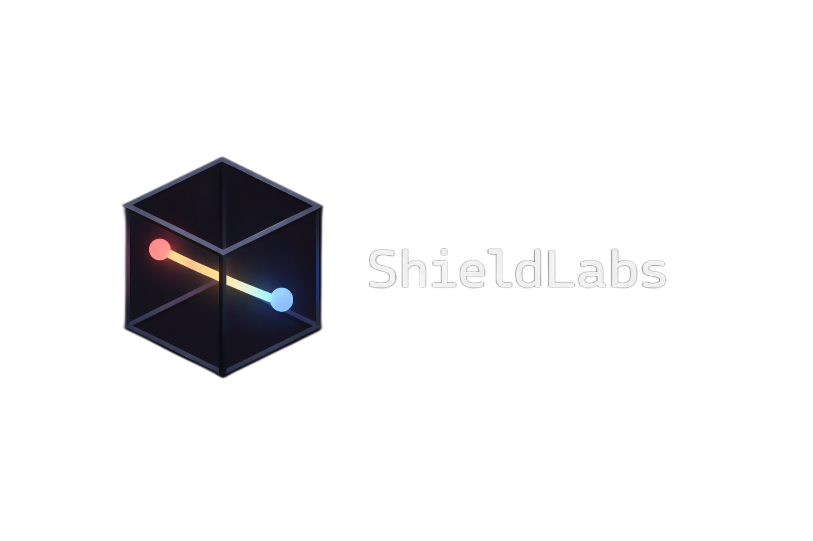

<p align="center">
  
</p>

## Overview

ShieldLabs is a C++20 application for radiation shielding and dose calculation. It uses calibrated 2D floorplans and ray-based gamma transport to estimate dose across multi-layer shielding layouts.

The project combines geometry handling, material attenuation models, isotope data, and shielding optimization in one workflow. Its calculation engine, data registries, and user interface are kept separate so the core logic stays easier to validate and maintain.

ShieldLabs is intended for evaluating shielding layouts, source placement, dose-point response, PET/CT room shielding scenarios, and lead-thickness optimization.


## Repository Structure

```text
.
├── README.md                
├── .gitignore              
├── LICENSE                  # MIT license
└── cpp/
    ├── CMakeLists.txt       # Native build configuration
    ├── assets/
    │   ├── fonts/           # UI fonts
    │   ├── isotopes/        # Isotope data
    │   ├── logos/           # Branding assets
    │   └── materials/       # Material data
    │
    ├── external/            # Vendored dependencies
    │   ├── ImGuiFileDialog/
    │   ├── imgui/
    │   ├── imgui-sfml/
    │   ├── json/
    │   ├── nlopt/
    │   ├── sfml/
    │   ├── tabulate/
    │   └── yaml-cpp/
    │
    ├── include/             # Header files
    │   ├── app/
    │   ├── calc/
    │   ├── geometry/
    │   ├── isotopes/
    │   ├── materials/
    │   ├── optimization/
    │   ├── output/
    │   ├── ui/
    │   └── utils/
    │
    ├── resources/           # Platform resources
    │   └── shieldlabs.rc    
    │
    └── src/                 # Source files
        ├── calc/
        ├── geometry/
        ├── isotopes/
        ├── materials/
        ├── optimization/
        ├── output/
        ├── ui/
        └── utils/

```

## Dependencies

ShieldLabs is built and tested against the following versions:

| Library | Version |
|----------|----------|
| SFML | vendored commit 6b23a47 |
| Dear ImGui | 1.92.6 |
| ImGui-SFML | 3.0.0 |
| ImGuiFileDialog | 0.6.9 |
| NLopt | 2.7.1 |
| yaml-cpp | 0.8.0 |
| nlohmann/json | 3.11.3 |
| tabulate | 1.5.0 |

All third-party dependencies are vendored locally within the repository to provide deterministic cross-platform builds across Linux, macOS, and Windows.

## Isotopes and Shielding Materials

| Type      | Name             | Symbol |
|-----------|------------------|--------|
| Isotope   | Carbon-11        | C-11   |
| Isotope   | Fluorine-18      | F-18   |
| Isotope   | Gallium-68       | Ga-68  |
| Isotope   | Technetium-99m   | Tc-99m |
| Isotope   | Iodine-131       | I-131  |
| Isotope   | Lutetium-177     | Lu-177 |
| Isotope   | Radium-226       | Ra-226 |
| Isotope   | Actinium-225     | Ac-225 |
| Material  | Concrete         | —      |
| Material  | Steel            | —      |
| Material  | Lead             | —      |

## Usage

### Build Requirements

- CMake
- Git
- A C++20-capable compiler

Platform-specific requirements:

- Linux and macOS: `pkg-config` and `poppler-cpp` development headers
- Windows: Visual Studio/MSVC and `vcpkg` with `poppler`

Initialize submodules before configuring the project:

```bash
git submodule update --init --recursive
```

### Windows Build

1. Install `poppler` with `vcpkg` for your Windows triplet.

2. Configure CMake from the repository root and pass the `vcpkg` toolchain file:

```powershell
cmake -S cpp -B cpp\build\windows -DCMAKE_TOOLCHAIN_FILE=<path-to-vcpkg>/scripts/buildsystems/vcpkg.cmake
```

3. Build the project:

```powershell
cmake --build cpp\build\windows --config Release
```

4. Run `shieldlabs.exe` from the build output directory.

Notes:

- On Windows, the executable must remain beside its dependent DLLs.
- The `assets` directory is copied into the output folder automatically after build.
- If the `vcpkg` toolchain file is not provided during configure, CMake will not find the Windows Poppler package.

### Linux and macOS Build

1. Install `pkg-config` and `poppler-cpp` using your system package manager.

2. Configure the project from the repository root:

```bash
cmake -S cpp -B cpp/build/native
```

3. Build it:

```bash
cmake --build cpp/build/native
```

4. Run `./shieldlabs` from the build output directory.

### Toolbar Guide

| Button | Description |
|--------|-------------|
| `Selection` | Select and inspect geometry. |
| `Editing` | Switch to placement and editing mode. |
| `Add Wall` | Place a wall segment. |
| `Add Source` | Place a radiation source. |
| `Add Dose` | Place a dose point. |
| `Delete` | Remove the selected item. |
| `Undo` | Reverse the last action. |
| `Redo` | Restore the last undone action. |
| `Isotopes` | Show the list of supported isotopes. |
| `Materials` | Show the list of supported materials. |
| `Run Calc` | Calculate dose and lock geometry. |
| `Unlock Geometry` | Unlock geometry so you can edit again. |
| `Optimize` | Optimize shielding. |
| `Results` | Show optimization results. |
| `Info` | Toggle wall layer contents plus source and dose annotations. |
| `Edit Scale` | Recalibrate the floorplan scale. |
| `Help` | Open the in-application help window. |
| `Save` | Save the project or export results. |


## References

1. Canadian Nuclear Safety Commission (CNSC), *REGDOC-2.5.6: Design of Rooms Where Unsealed Nuclear Substances Are Used*, May 2023.
2. Canadian Nuclear Safety Commission (CNSC), *Radionuclide Information Booklet*, July 2025 edition.
3. Marsden, M. et al., AAPM Task Group 108, *PET and PET/CT Shielding Requirements*, Medical Physics, 2006.


## License

ShieldLabs is released under the MIT License. See [LICENSE](LICENSE) for details.

## Author
Developed by Aidan Richer <richer2@uwindsor.ca | richer.a@outlook.com>
